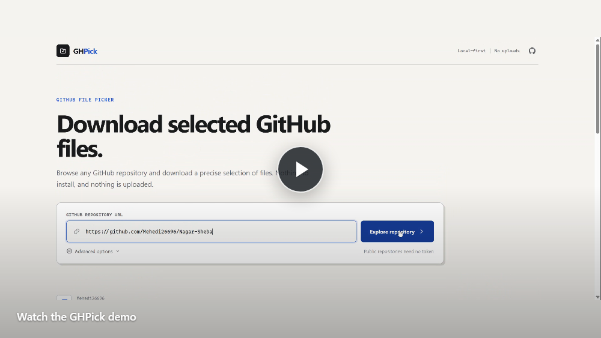

# GHPick

Download specific files and folders from a GitHub repository without cloning the
whole project.

GHPick provides a browser interface built with plain HTML, CSS, and JavaScript.
An optional Python CLI is also included for scripting and terminal workflows.

## Demo

[](demo.webm)

Click the preview to watch the demo.

## What it can do

- Browse a GitHub repository as a file tree
- Select individual files or complete folders
- Search paths and filter with glob patterns such as `*.py` or `src/**`
- Download one file directly or multiple files as a ZIP
- Open public repositories without authentication
- Access private repositories with a GitHub token
- Display the remaining GitHub API quota

## Use the web app

Open [`web/index.html`](web/index.html) in a modern browser.

If the browser restricts local requests, serve the folder locally:

```bash
python -m http.server 8000 --directory web
```

Then open <http://localhost:8000>.

Paste a GitHub repository, folder, or file URL into GHPick:

```text
https://github.com/owner/repository
https://github.com/owner/repository/tree/main/src
https://github.com/owner/repository/blob/main/README.md
```

Public repositories do not require a token. For private repositories or a
higher API limit, open **Advanced options** and enter a GitHub token. The web app
keeps the token only in page memory and sends it directly to GitHub.

> The browser cannot read the project's `.env` file. The `.env` token is used
> only by the Python CLI.

## Optional CLI

The CLI is useful for automation and large downloads.

Requirements: Python 3.11 or newer.

```bash
python -m venv .venv

# Windows
.venv\Scripts\activate

# macOS or Linux
source .venv/bin/activate

pip install -e .
```

Examples:

```bash
# Download a folder
ghpick https://github.com/owner/repository/tree/main/src

# Download one file
ghpick https://github.com/owner/repository/blob/main/README.md

# Preview matching files
ghpick https://github.com/owner/repository/tree/main/src --list

# Include only Python files and exclude tests
ghpick https://github.com/owner/repository/tree/main/src --include "*.py" --exclude tests

# Open the terminal file browser
ghpick browse https://github.com/owner/repository

# Check the GitHub API quota
ghpick rate-limit
```

Run `ghpick --help` for all options.

## GitHub token

The CLI reads only `GITHUB_ACCESS_TOKEN`:

```env
GITHUB_ACCESS_TOKEN=your_token
```

Store it in the project `.env` file or define it in your shell. The `.env` file
is ignored by Git and must never be committed.

## Project structure

```text
web/                 Browser interface
  index.html
  styles.css
  app.js
src/ghpick/          Python CLI package
tests/               Python tests
pyproject.toml       Package configuration
```

The web app has no frontend dependencies, frameworks, build step, analytics, or
backend server. It communicates directly with GitHub's API.

## Development

Run the Python tests:

```bash
pytest
```

Current result: **27 tests passing**.

## Browser limitations

- GitHub may truncate extremely large repository trees.
- ZIP files are created in browser memory, so the CLI is preferable for very
  large selections.
- The browser download location is controlled by browser settings.

## License

Open-source project created by H.M. Mehedi Hasan.
